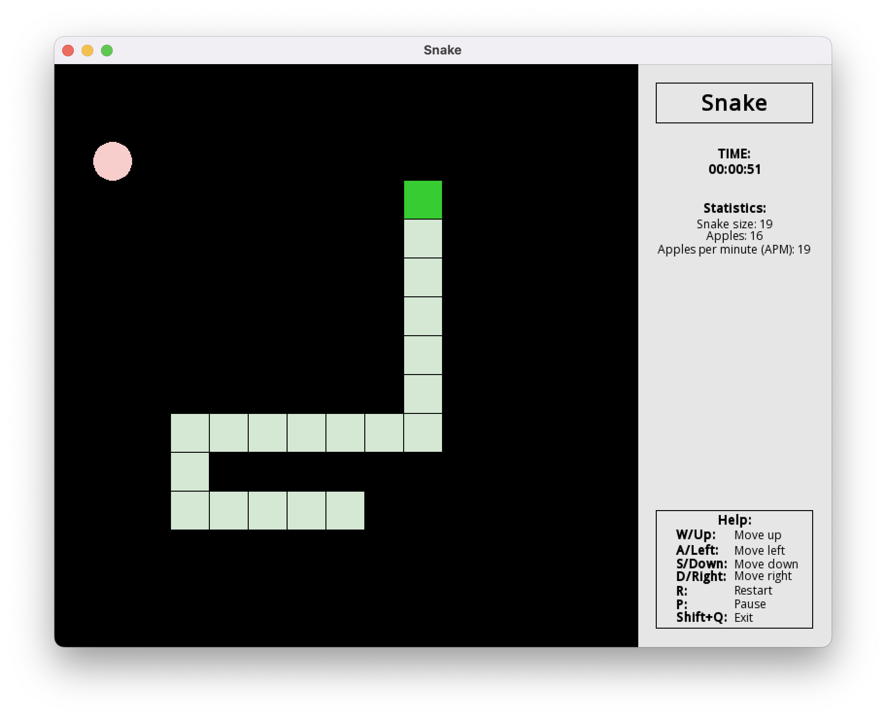

# Snake

A classic snake developed in C++ using the cross-platform software development library SFML.

# Screenshots

## Getting Started

To build and run the game, you can either call the CMake commands directly, or use a Makefile (make) that wraps these commands.

### Prerequisites

* CMake (minimum 3.27.9).
* C++ compiler (GCC, ClangApple Clang compiler, Clang)

Microsoft Visual C++ - functionality not verified.

### Installation

If you want to call CMake commands yourself:
1. cmake -S . -B build
2. cmake --build build --config Release
3. cmake --install build --config Release

Otherwise, you can use Makefile (make):
1. make compile

### Launch

Once built, the binaries will be available in the `build/bin` folder. To start, you need to run the Snake file.
